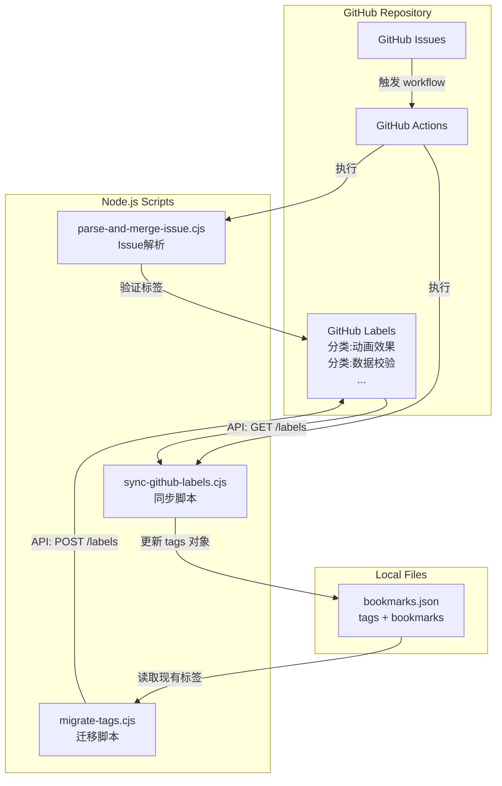

# Design Document

## Overview

本设计文档描述如何实现 GitHub Labels 同步标签云功能，包括：
1. 标签体系重构的数据迁移方案
2. GitHub Labels 与本地 bookmarks.json 的双向同步机制
3. GitHub Actions 自动化工作流

## Architecture



## Components and Interfaces

### 1. 标签命名规范

GitHub Labels 使用前缀区分不同类型：

| 前缀 | 用途 | 示例 |
|------|------|------|
| `分类:` | 工具分类标签（同步到网站） | `分类:动画效果`、`分类:数据校验` |
| 无前缀 | 系统标签（Issue 工作流） | `待审核`、`已收录`、`收录通过` |

### 2. 同步脚本 (sync-github-labels.cjs)

```javascript
/**
 * 从 GitHub Labels 同步标签到 bookmarks.json
 * 
 * 输入: GitHub API 返回的 labels 列表
 * 输出: 更新后的 bookmarks.json
 * 
 * 接口定义:
 */
interface GitHubLabel {
    name: string;        // "分类:动画效果"
    color: string;       // "d6bce6" (6位十六进制，无#)
    description: string; // 标签描述
}

interface TagConfig {
    className: string;
    color: string;           // "#d6bce6"
    backgroundColor: string; // "hsl(277.5, 45%, 82%)"
    textColor: string;       // "hsl(277.5, 65%, 32%)"
}

interface SyncResult {
    added: string[];    // 新增的标签
    updated: string[];  // 更新的标签
    removed: string[];  // 删除的标签
    unchanged: string[];// 未变化的标签
}
```

### 3. 迁移脚本 (migrate-tags.cjs)

```javascript
/**
 * 将本地标签迁移到 GitHub Labels
 * 
 * 功能:
 * 1. 读取 bookmarks.json 中的 tags
 * 2. 为每个标签创建 GitHub Label（添加 "分类:" 前缀）
 * 3. 转换颜色格式（HSL → Hex）
 */
interface MigrationConfig {
    dryRun: boolean;     // 是否只预览不执行
    skipExisting: boolean; // 跳过已存在的标签
}

interface MigrationResult {
    created: string[];   // 成功创建的标签
    skipped: string[];   // 跳过的标签（已存在）
    failed: string[];    // 创建失败的标签
}
```

### 4. 颜色转换工具

```javascript
/**
 * 颜色格式转换函数
 */

// GitHub Label 颜色 → 网站显示颜色
function hexToTagConfig(hexColor: string): TagConfig {
    // 输入: "d6bce6" (无#的6位hex)
    // 输出: { color, backgroundColor, textColor }
}

// 网站颜色 → GitHub Label 颜色
function tagConfigToHex(tagConfig: TagConfig): string {
    // 输入: TagConfig 对象
    // 输出: "d6bce6" (无#的6位hex)
}

// HSL 字符串解析
function parseHSL(hslString: string): { h: number, s: number, l: number } {
    // 输入: "hsl(277.5, 45%, 82%)"
    // 输出: { h: 277.5, s: 45, l: 82 }
}
```

## Data Models

### bookmarks.json 结构（保持不变）

```json
{
    "tags": {
        "All": { "className": "bg-gray-100 text-gray-800", "color": "#9b59b6" },
        "动画效果": {
            "className": "",
            "color": "#d6bce6",
            "backgroundColor": "hsl(277.5, 45%, 82%)",
            "textColor": "hsl(277.5, 65%, 32%)"
        },
        "__meta__": {
            "lastColorIndex": 40,
            "totalTags": 40,
            "lastUpdated": "2026-01-08T10:00:00.000Z",
            "syncedFromGitHub": true
        }
    },
    "bookmarks": [...]
}
```

### GitHub Label 结构

```json
{
    "name": "分类:动画效果",
    "color": "d6bce6",
    "description": "CSS/JS 动画库，如 Anime.js, GSAP"
}
```

### 标签映射配置文件 (tag-mapping.json)

```json
{
    "version": "2.0",
    "mappings": {
        "数据处理": ["状态管理", "数据校验"],
        "工具库": ["工具函数", "唯一标识", "模糊搜索", "模拟数据", "编码转换"],
        "编辑器": ["代码编辑", "富文本编辑", "终端模拟", "JSON编辑"],
        "图像处理": ["图片处理", "图片生成"],
        "文件操作": ["文件上传", "文件解析", "文件检测"],
        "多媒体": ["视频播放", "音频处理"],
        "数学": ["数学计算", "公式渲染"],
        "样式": ["CSS框架", "CSS重置", "动画效果"],
        "数据可视化": ["图表可视化", "流程图"]
    },
    "bookmarkMappings": {
        "Immer": ["状态管理"],
        "Mutative": ["状态管理"],
        "Zod": ["数据校验"],
        "Valibot": ["数据校验"],
        "class-validator": ["数据校验"],
        "lodash": ["工具函数"],
        "radash": ["工具函数"],
        "uuid": ["唯一标识"],
        "Fuse.js": ["模糊搜索"],
        "Mock.js": ["模拟数据"],
        "reveal.js": ["演示文稿"],
        "TinyColor": ["颜色选择"],
        "js-base64": ["编码转换"],
        "Monaco Editor": ["代码编辑"],
        "CodeMirror 5": ["代码编辑"],
        "Highlight.js": ["代码编辑"],
        "Milkdown": ["富文本编辑"],
        "JSON Editor": ["JSON编辑"],
        "xterm.js": ["终端模拟"],
        "Video.js": ["视频播放"],
        "HLS.js": ["视频播放"],
        "Plyr": ["视频播放"],
        "Wavesurfer.js": ["音频处理"],
        "ECharts": ["图表可视化"],
        "bpmn-js": ["流程图"],
        "Cropper.js": ["图片处理"],
        "Viewer.js": ["图片处理"],
        "tui.image-editor": ["图片处理"],
        "SnapDOM": ["图片生成"],
        "QRCode.js": ["图片生成"],
        "FilePond": ["文件上传"],
        "Uppy": ["文件上传"],
        "docxjs": ["文件解析"],
        "Marked": ["文件解析"],
        "Turndown": ["文件解析"],
        "jszip": ["文件解析"],
        "file-type": ["文件检测"],
        "mime": ["文件检测"],
        "KaTeX": ["公式渲染"],
        "Bignumber.js": ["数学计算"],
        "decimal.js": ["数学计算"],
        "Dinero.js": ["数学计算"],
        "Numeral.js": ["数学计算"],
        "Tailwind CSS": ["CSS框架"],
        "UnoCSS": ["CSS框架"],
        "Normalize.css": ["CSS重置"],
        "Animate.css": ["动画效果"],
        "Loaders.css": ["加载动画"],
        "Anime": ["动画效果"],
        "GSAP": ["动画效果", "滚动交互"],
        "CountUp.js": ["动画效果"],
        "SortableJS": ["拖拽排序"],
        "Swapy": ["拖拽排序"],
        "interact.js": ["拖拽排序", "手势识别"],
        "OverlayScrollbars": ["滚动交互"],
        "Scrollama": ["滚动交互"],
        "hammer.js": ["手势识别"],
        "Axios": ["网络请求"],
        "Socket.IO": ["网络请求", "实时协作"],
        "fetch-event-source": ["网络请求"],
        "yjs": ["实时协作"],
        "Day.js": ["日期时间"],
        "Moment.js": ["日期时间"],
        "pinyin-pro": ["国际化"],
        "Nzh": ["国际化"],
        "DOMPurify": ["安全防护"],
        "crypto-js": ["安全防护"],
        "Store.js": ["本地存储"],
        "Cookie": ["本地存储"],
        "clipboard.js": ["剪贴板"],
        "tinykeys": ["快捷键"],
        "Intro.js": ["用户引导"],
        "driver.js": ["用户引导"],
        "Lucide": ["图标库"],
        "Iconoir": ["图标库"],
        "Mage Icons": ["图标库"],
        "iro.js": ["颜色选择"],
        "Pickr": ["颜色选择"],
        "Swiper": ["轮播组件"],
        "FullCalendar": ["日历组件"],
        "Tippy.js": ["提示组件"],
        "Signature Pad": ["签名组件"],
        "simple-keyboard": ["虚拟键盘"],
        "morphdom": ["DOM操作"]
    }
}
```


## GitHub Actions Workflow

### sync-labels.yml

```yaml
name: 🏷️ Sync GitHub Labels to Tags

on:
    # 当 Label 变更时触发
    label:
        types: [created, edited, deleted]
    # 手动触发
    workflow_dispatch:

jobs:
    sync-labels:
        runs-on: ubuntu-latest
        permissions:
            contents: write
        
        steps:
            - uses: actions/checkout@v4
            
            - name: Setup Node.js
              uses: actions/setup-node@v4
              with:
                  node-version: '20'
            
            - name: Sync Labels
              env:
                  GITHUB_TOKEN: ${{ secrets.GITHUB_TOKEN }}
              run: node scripts/sync-github-labels.cjs
            
            - name: Commit Changes
              run: |
                  git config user.name "github-actions[bot]"
                  git config user.email "github-actions[bot]@users.noreply.github.com"
                  git add src/data/bookmarks.json
                  git diff --staged --quiet || git commit -m "🏷️ Sync labels from GitHub"
                  git push
```

## Error Handling

### 错误类型与处理策略

| 错误类型 | 处理策略 |
|---------|---------|
| GitHub API 请求失败 | 重试 3 次，失败后退出并输出错误 |
| 标签名称为空 | 跳过该标签，输出警告 |
| 颜色格式无效 | 使用默认颜色，输出警告 |
| 文件写入失败 | 退出并输出错误 |
| 标签被删除但仍有书签使用 | 输出警告，不删除标签配置 |

### 日志输出格式

```
🔄 开始同步 GitHub Labels...
📥 获取到 42 个 Labels
📋 过滤出 40 个分类标签（前缀: 分类:）
✨ 新增标签: 状态管理, 数据校验
🔄 更新标签: 动画效果 (颜色变更)
⚠️ 警告: 标签 "工具库" 已删除，但仍有 5 个书签使用
✅ 同步完成: 新增 2, 更新 1, 删除 0, 未变化 37
```

## Testing Strategy

### 单元测试

1. **颜色转换测试**
   - hexToHSL 转换准确性
   - hslToHex 转换准确性
   - 边界值测试（纯黑、纯白、高饱和度）

2. **标签解析测试**
   - 前缀移除正确性
   - 特殊字符处理
   - 空标签名处理

3. **同步逻辑测试**
   - 新增标签检测
   - 更新标签检测
   - 删除标签检测
   - 保留特殊标签（All, __meta__）

### 集成测试

1. **GitHub API Mock 测试**
   - 模拟 API 响应
   - 测试完整同步流程

2. **文件读写测试**
   - bookmarks.json 格式保持
   - 并发写入安全性


## Correctness Properties

*A property is a characteristic or behavior that should hold true across all valid executions of a system—essentially, a formal statement about what the system should do. Properties serve as the bridge between human-readable specifications and machine-verifiable correctness guarantees.*

### Property 1: Tag Coverage Completeness

*For any* bookmark in the bookmarks array, there must exist at least one tag in the new tag system that is assigned to it, and the number of tags per bookmark must be between 1 and 3.

**Validates: Requirements 0.2, 0.5**

### Property 2: Label Prefix Filtering

*For any* list of GitHub labels, filtering by the `分类:` prefix should return only labels that start with that exact prefix, and all other labels should be excluded.

**Validates: Requirements 1.2, 1.3**

### Property 3: Color Conversion Round-Trip

*For any* valid hex color (6 characters, 0-9 and a-f), converting to HSL and back to hex should produce an equivalent color (within acceptable tolerance for rounding).

**Validates: Requirements 2.2, 7.3**

### Property 4: Text Color Contrast

*For any* background color, the generated text color should have a contrast ratio of at least 4.5:1 (WCAG AA standard) to ensure readability.

**Validates: Requirements 2.3**

### Property 5: Label Name Round-Trip

*For any* display tag name (without prefix), adding the `分类:` prefix and then removing it should produce the original tag name.

**Validates: Requirements 3.1, 7.2**

### Property 6: Sync Consistency

*For any* set of GitHub labels with the `分类:` prefix, after syncing to bookmarks.json:
- Every prefixed label should have a corresponding entry in the tags object
- The color configuration should match the GitHub label color
- Labels not in GitHub (except `All` and `__meta__`) should be removed

**Validates: Requirements 4.1, 4.2, 4.3, 4.4**

### Property 7: Color Generation Determinism

*For any* tag index, the color generation algorithm should produce the same color every time, ensuring consistent colors for new tags.

**Validates: Requirements 6.3**

### Property 8: Tag Validation Consistency

*For any* submitted tag in an issue, if the tag exists in the category labels, validation should pass; if it doesn't exist, a new label should be created with the correct prefix.

**Validates: Requirements 6.1**

### Property 9: Migration Mapping Completeness

*For any* bookmark in the existing bookmarks.json, there must be a corresponding entry in the bookmarkMappings that specifies its new tags.

**Validates: Requirements 0.4**

